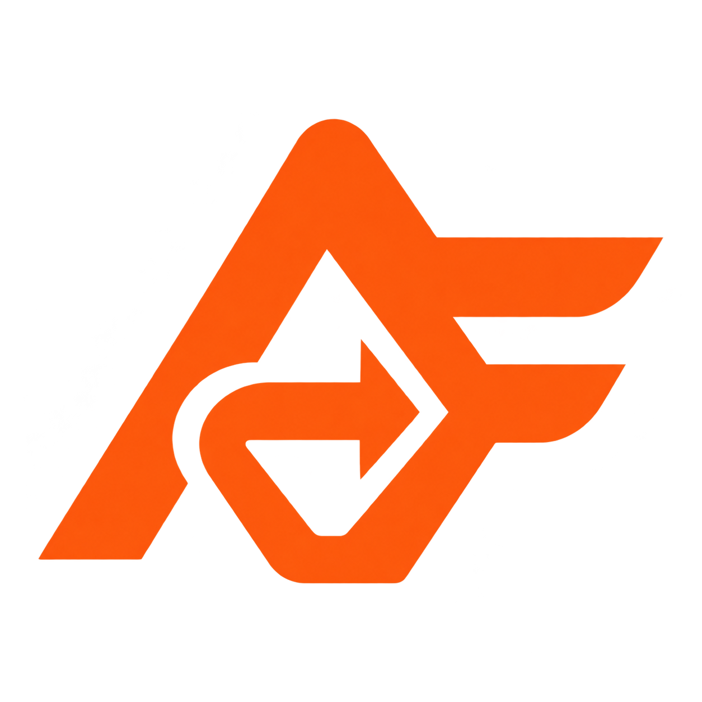
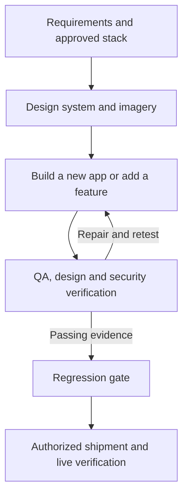

<div align="center">



# AutoForge

**Research the decision. Build the product. Verify every improvement.**

An autonomous iteration engine for Claude Code, OpenCode, and OpenAI Codex.

[](https://docs.anthropic.com/en/docs/claude-code)
[](https://opencode.ai)
[](https://developers.openai.com/codex)

[](LICENSE)

**21 commands · 3 agent platforms · bounded iteration · evidence-backed gates**

[Capabilities](#capabilities) · [Scenarios](#practical-scenarios) · [Install](#quick-start) · [Commands](#commands) · [Build Software](#building-complex-software) · [Secure & Ship](#security-and-shipping-guide) · [Guides](guide/)

</div>

---

AutoForge turns a goal into a repeatable **modify → verify → keep/discard** loop. Use it to build
and extend software, improve a measurable result, research a decision, or prepare a release.
`forge` is the command namespace; work happens inside your existing coding agent and repository.

Start with a plain-language goal, or provide an exact scope, metric, verification command and
iteration budget. Each run leaves a history of changes, results and evidence for the next step.

## Recent changes

These changes are in the current source under **unreleased v3.7.0**. The version badge reflects
the packaged release; see the [project changelog](docs/project-changelog.md) for release status.

- **Requirements you can review:** a living client review makes assumptions, user stories,
  success/failure scenarios, security concerns and operational needs visible before the spec.
- **Technology choices with evidence:** compare 3–5 real stacks, explain the recommendation and
  tradeoffs, and record your decision. Approval pins both the evidence and decision record;
  build confirms the choice with a measured spike. [Requirements guide](guide/forge-requirements.md).
- **More life in the interface:** design considers a restrained set of actual photos,
  illustrations or artworks, with coherent treatment, mobile crops and clear working areas.
  Selected assets must be delivered and visibly rendered. [Design guide](guide/forge-design.md).
- **Stronger security completion:** build and feature completion require current passing checks
  and saved evidence. Optional **Strix** adds isolated dynamic testing; incomplete scans, missing
  reports and unresolved blocking findings prevent readiness. [Security guide](guide/forge-security.md).

## Capabilities

| Area | What AutoForge covers | Start here |
|---|---|---|
| Goals and iteration | Natural-language orchestration, explicit metric loops, scope and guard checks, bounded runs, rollback and results analysis | `forge`, `plan`, `evals` |
| Requirements and stack selection | Client review, assumptions, stories, lifecycle scenarios, evidence-based stack comparisons, owner approval, SRS and acceptance specs | `requirements`, `probe` |
| Research and decisions | Primary-source reading, cited claims and confidence, disconfirmation, expert perspectives, blind judging, Markdown dossiers and arXiv/IEEE paper output | `research`, `predict`, `reason` |
| Product discovery | Customer problems, competitor gaps, ranked improvements and selected feature PRDs | `improve` |
| Software delivery | Greenfield builds and existing-app features; logic, functional, UX, DevOps, monitoring and hardening acceptance; non-regression ratchets | `build`, `feature` |
| Visual design and assets | Design direction, `DESIGN.md`, purposeful imagery, asset provenance and budgets, responsive crops, accessible motion, browser design audits and remediation | `design` |
| QA and debugging | Scenario exploration, risk-based plans, requirements traceability, domain-logic vectors, exploratory tests, defect ledgers, root-cause repairs and independent retesting | `scenario`, `test`, `debug`, `fix` |
| Security | STRIDE, OWASP/ASVS-guided checks, authorization and tenant isolation, secrets/dependencies, deployment boundaries and optional Strix verification | `security` |
| Stability and release | Baseline/candidate comparisons, performance regression checks, release checklists, dry runs, artifact-bound execution evidence, live verification and rollback | `regression`, `ship` |
| Android delivery | PWA preparation, Trusted Web Activity packaging, Digital Asset Links, signed bundles, emulator verification and store materials | `android` |
| Documentation and memory | Codebase docs, navigable wikis, checked links, run history and scoped procedures retained from verified recoveries | `learn`, [procedural lessons](.claude/skills/forge/references/procedural-lessons.md) |
| Integrations and runtime | Native image tools or media MCP, Figma import, GitHub/Linear tracking, environment checks, safety hooks and validated command handoffs | [Integrations and assets](#integrations-assets-and-memory), [hooks](#hooks--safety) |

The [command reference](#commands) lists all 21 commands. Required checks remain required when
a tool or integration is unavailable; the run reports what is blocked instead of assuming success.

---

## Why This Exists

Inspired by [Karpathy's autoresearch](https://github.com/karpathy/autoresearch), AutoForge applies
constrained experiments and measurable feedback to software and other domains. It adds the
requirements, design, research, testing and delivery workflows needed to take a project further.

A thin skill router loads command bodies and references only when needed. Git history and run
artifacts preserve the work between iterations and sessions.

---

## How It Works

```
LOOP (N iterations or until done):
  1. Review current state + git history + results log
  2. Pick the next change (based on what worked, what failed, what's untried)
  3. Make ONE focused change
  4. Git commit (before verification)
  5. Run mechanical verification (tests, benchmarks, scores)
  6. If improved → keep. If worse → git revert. If crashed → fix or skip.
  7. Log the result
  8. Repeat until N iterations complete or goal is met.
```

Every improvement stacks. Every failure auto-reverts. Progress is logged in TSV format.

### The Setup Phase

Before looping, the agent performs a one-time setup:

1. **Read context** — reads all in-scope files
2. **Define goal** — extracts or asks for a mechanical metric
3. **Define scope** — which files can be modified vs read-only
4. **Establish baseline** — runs verification on current state (iteration #0)
5. **Confirm and go** — shows setup, then begins the loop

### 8 Critical Rules

| # | Rule |
|---|------|
| 1 | **Bounded by default** — every command has a default iteration count; unlimited is opt-in via `Iterations: unlimited` |
| 2 | **Read before write** — understand full context before modifying |
| 3 | **One change per iteration** — atomic changes; if it breaks, you know why |
| 4 | **Mechanical verification only** — no subjective "looks good"; use metrics |
| 5 | **Automatic rollback** — failed changes revert instantly |
| 6 | **Simplicity wins** — equal results + less code = keep |
| 7 | **Git is memory** — experiments committed with `experiment:` prefix; agent reads `git log` + `git diff` before each iteration |
| 8 | **When stuck, think harder** — re-read, combine near-misses, try radical changes |

---

## Hooks & Safety

v2.1.1 ships a 9-hook safety system that protects your sessions automatically. Hooks fire on every session — not just during forge commands.

### What's Protected

| Hook | What it does | Event |
|------|-------------|-------|
| **scout-block** | Blocks node_modules/, .git/, __pycache__/, etc. from filling your context | PreToolUse |
| **privacy-block** | Blocks .env, SSH keys, credentials from being read in sessions | PreToolUse |
| **dangerous-cmd-block** | Blocks force-push, `rm -rf`, `git reset --hard` | PreToolUse |
| **iteration-context** | Injects recent TSV iteration data after context compaction | UserPromptSubmit |
| **subagent-context** | Gives subagents awareness of active loop state | SubagentStart |
| **dev-rules-reminder** | Re-injects plan path and code standards after compaction | UserPromptSubmit |
| **simplify-gate** | Warns at 400 LOC, blocks at 800 LOC before shipping | UserPromptSubmit |
| **session-init** | Sets up project context at session start | SessionStart |
| **stop-notify** | Terminal notification + optional webhook on session end | SessionEnd |

### Configuration

All hooks are **on by default**. Disable individually:

```bash
# Disable a specific hook
export AR_DISABLE_SCOUT_BLOCK=1
export AR_DISABLE_PRIVACY_BLOCK=1
export AR_DISABLE_DANGEROUS_CMD_BLOCK=1
# ... etc for each hook name
```

Optional webhook for session completion notifications:

```bash
export AR_NOTIFY_WEBHOOK=https://hooks.slack.com/services/...
```

Customize blocked directories with a `.ckignore` file (gitignore syntax) at your project root.

See [guide/hooks.md](guide/hooks.md) for full reference.

---

## Commands

| Command | What it does | Default Iterations |
|---------|--------------|--------------------|
| `/forge` | Improve a measured result, or route a plain-language goal through the appropriate workflows | 25 / goal-bounded |
| `/forge:plan` | Convert goal into validated config | one-shot |
| `/forge:requirements` | Review assumptions and scenarios, research and approve the stack, then validate the SRS and build spec | one-shot |
| `/forge:build` | Build a new app through the SDLC, with six acceptance dimensions and separate logic/design/security gates | 40 |
| `/forge:feature` | Extend an existing app with new acceptance checks and a hard non-regression ratchet | 25 |
| `/forge:test` | Plan and execute independent QA, trace requirements, record defects and gate release readiness | 20 |
| `/forge:design` | Create `DESIGN.md`, plan imagery, audit a running UI and remediate design/accessibility defects | 12 (`--fix`) |
| `/forge:research` | Produce a cited dossier with checked claims; optionally generate arXiv/IEEE papers | 15 |
| `/forge:android` | Package a deployed web app as a verified, signed Android TWA with a store pack | 12 |
| `/forge:debug` | Hunt bugs via hypothesis iteration | 15 |
| `/forge:fix` | Remediate defects to zero, root-cause first | 20 |
| `/forge:security` | Audit security boundaries, optionally run Strix, and gate readiness on checks and unresolved findings | 15 |
| `/forge:ship` | Check, preview, authorize, execute and verify a shipment; handle rollback | linear |
| `/forge:scenario` | Generate edge cases across 12 dimensions | 20 |
| `/forge:predict` | 5 expert personas debate | one-shot |
| `/forge:learn` | Create, update, check or summarize documentation; build a navigable codebase wiki | 10 |
| `/forge:reason` | Adversarial debate with blind judges | 8 |
| `/forge:probe` | Interrogate assumptions and constraints with adversarial personas | 15 |
| `/forge:improve` | Research ICP, discover improvements, generate PRDs | 15 |
| `/forge:evals` | Analyze iteration results: trends, plateaus | one-shot |
| `/forge:regression` | Stability gate: baseline vs candidate, verdict STABLE/UNSTABLE | one-shot |

**Universal flags:** `Iterations: N`, `Iterations: unlimited`, `--evals`, `--evals-interval N`, `--chain <targets>`, `--<subcommand>` shorthand.

Commands use available project context and ask for missing inputs. Enter them in the agent's chat;
they are workflows, not a standalone `forge` shell executable.

| Platform | Core loop / goal | Subcommand example |
|---|---|---|
| Claude Code | `/forge` | `/forge:design` |
| Codex | `$forge` | `$forge design` |
| OpenCode | `/forge` | `/forge_design` |

### Quick Decision Guide

| I want to... | Use |
|--------------|-----|
| Build a new full-stack app from scratch (full SDLC) | `/forge:build` |
| Turn a client brief into a validated build spec | `/forge:requirements` |
| Compare technology stacks and approve the reasons for the choice | `/forge:requirements` with your constraints and any `Stack:` hint |
| Add a feature to an existing app without regressions | `/forge:feature` |
| Run a full QA engagement on an existing app (plan → RTM → verdict) | `/forge:test` |
| Research a topic into a cited, source-anchored dossier | `/forge:research` |
| Ship a built web app as an Android app (Play-ready TWA) | `/forge:android` |
| Give a plain-language goal, let it self-orchestrate | `/forge <goal>` (bare, no Metric/Verify) |
| Improve test coverage / reduce bundle size / any metric | `/forge` |
| Run bounded iterations | Add `Iterations: N` to any command |
| Don't know what metric to use | `/forge:plan` |
| Run a security audit | `/forge:security` |
| Add dynamic penetration testing to the audit | `/forge:security --strix --strix-budget <USD>` |
| Give the interface a coherent visual direction and purposeful imagery | `/forge:design system` → `/forge:design audit --fix` |
| Ship a PR / deployment / release | `/forge:ship` |
| Optimize without breaking existing tests | Add `Guard: npm test` |
| Hunt all bugs in a codebase | `/forge:debug` |
| Fix all errors (tests, types, lint) | `/forge:fix` |
| Remediate a QA engagement's defect ledger | `/forge:fix --from-test` |
| Run the full QA ↔ remediation loop unattended | `/forge:test Target: <app> --chain fix` |
| Debug then auto-fix | `/forge:debug --fix` |
| Check if something is ready to ship | `/forge:ship --checklist-only` |
| Explore edge cases for a feature | `/forge:scenario` |
| Generate test scenarios | `/forge:scenario --format test-scenarios` |
| Get expert opinions before starting | `/forge:predict` |
| Analyze from multiple angles then debug | `/forge:predict --chain debug` |
| Generate docs for a new codebase | `/forge:learn --mode init` |
| Create a navigable codebase knowledge base | `/forge:learn --mode wiki` |
| Update existing docs after changes | `/forge:learn --mode update` |
| Debate an architecture decision | `/forge:reason --domain software` |
| Surface hidden constraints before starting | `/forge:probe` |
| Pre-flight a fuzzy goal then loop | `/forge:probe --chain plan,forge` |
| Discover what to build next for your ICP | `/forge:improve` |
| Research competitors and generate PRDs | `/forge:improve --depth deep` |
| Probe requirements then research improvements | `/forge:probe --improve` |
| Analyze trends and plateaus across past runs | `/forge:evals` |
| Check if a run has stalled | `/forge:evals --file *-results.tsv` |
| Verify a change won't regress before pushing | `/forge:regression` |
| Gate a PR: predict, fix, re-gate, then ship | `/forge:regression --predict --fix --ship` |

---

## Practical scenarios

These examples use **Codex chat syntax**. Use the platform equivalents above for Claude Code or
OpenCode. Run one command at a time; replace paths, domains and budgets with your project's values.
Each scenario names the evidence you should expect, so progress is more than a finished response.

<details>
<summary><strong>1. Turn a product idea into a working app</strong></summary>

You want a booking service, but the cancellation rules, staff access and technology choices are
still unclear. Start by reviewing the business behavior before implementation.

```text
$forge requirements
Brief: A booking service for small studios with availability, deposits, cancellations and staff access.
Name: studio-booking
--chain build
```

**Expected:** a corrected client review, concrete success/failure scenarios, an evidence-backed
stack decision you approve, and a validated spec. Build then confirms the stack, implements the
app and verifies acceptance, design and security. Requirements approval precedes the build handoff.

</details>

<details>
<summary><strong>2. Add a feature without breaking existing behavior</strong></summary>

An existing booking app needs staff roles and exports that cannot leak another studio's data.

```text
$forge feature Target: apps/booking
Feature: Add staff roles and tenant-isolated booking exports.
Iterations: 25
```

**Expected:** new role/export acceptance checks, negative access tests, current security evidence
and a regression comparison against the existing green baseline. Passing checks become part of
the permanent acceptance set; a change that breaks an existing check is reverted.

</details>

<details>
<summary><strong>3. Make a useful but bland interface feel considered</strong></summary>

The app works, but looks generic. Give it a clear visual direction and a few relevant images while
keeping booking tables and forms easy to use.

```text
$forge design system Target: apps/booking Mode: operate Assets: 6 --refresh
Brief: A calm studio workspace with a few authentic photos or editorial illustrations. Keep schedules and forms clear.
```

Then apply and verify the direction:

```text
$forge design audit Target: apps/booking --fix Iterations: 12
```

**Expected:** `DESIGN.md` with an imagery plan, actual approved assets in the app, desktop/mobile
crops, accessible contrast and motion, and a design defect ledger with a fresh verdict. `Assets: 6`
caps generation attempts; it does not request six decorative images.

</details>

<details>
<summary><strong>4. Find failures before customers encounter them</strong></summary>

Two customers can reserve the last slot while payment callbacks are retried. Explore the awkward
cases, then assess the implementation independently.

```text
$forge scenario Scenario: Two customers reserve the last slot while payment callbacks are retried.
--domain software --format test-scenarios Iterations: 20
```

Use the resulting scenarios in the QA plan:

```text
$forge test Target: apps/booking --chain fix
```

**Expected:** concurrency, duplicate-event, failed-payment and recovery scenarios; a test plan and
traceability matrix; reproducible defects; root-cause repairs. A separate QA re-engagement verifies
fixes. If the failure needs investigation first, start with `debug --fix` and the observed symptom.

</details>

<details>
<summary><strong>5. Check security before preparing a release</strong></summary>

The app handles multiple customers' private records. Audit the source and integration boundaries,
and add Strix when Docker, a model/provider and authorized scan scope are available.

```text
$forge security --strix --strix-budget 5 --fail-on high
Scope: src/**, tests/**, package.json, package-lock.json, Dockerfile
Focus: cross-tenant access, session revocation, exports and payment callback replay
Depth: standard
```

**Expected:** the normal security baseline plus an isolated Strix scan, redacted native reports
and one findings ledger. Budget stops and missing evidence block readiness; unresolved High/Critical
findings require repair and retest. Once security passes, run `regression`, then `ship --dry-run`
for the intended destination before authorizing the actual shipment.

</details>

<details>
<summary><strong>6. Research a technical decision or a product opportunity</strong></summary>

You need sources and tradeoffs before choosing a synchronization approach.

```text
$forge research Topic: Offline-first synchronization approaches for a multi-user scheduling app.
Audience: The engineering team choosing a conflict-resolution strategy.
Iterations: 15
--chain reason
```

**Expected:** accessed sources, reading notes, a claims ledger with confidence and counterevidence,
a cited dossier and a reasoned comparison. Add `Format: arxiv,ieee` when paper output is useful;
PDF compilation needs a LaTeX toolchain. For customer-problem discovery instead, use `improve` with
an `ICP:`; it ranks opportunities and writes PRDs for the features you select.

</details>

<details>
<summary><strong>7. Bring an existing web app to Android</strong></summary>

The production web app already works and you want an Android package using the same experience.

```text
$forge android Target: apps/booking Url: https://booking.example.com
Package: com.example.booking Track: none Iterations: 12
```

**Expected:** PWA checks, verified site/app trust, signed AAB/APK artifacts, emulator evidence and
store materials. Replace the example domain with the app's actual deployed HTTPS origin. Native-only
requirements remain visible blockers; `Track: none` produces artifacts without a Play upload.

</details>

<details>
<summary><strong>8. Improve a measurable result and keep the project understandable</strong></summary>

The API is slow, and you want an optimization budget with a guard against broken checkout behavior.

```text
$forge plan Goal: Bring API p95 latency below 200ms while keeping checkout tests green.
Scope: src/api/**
```

**Expected:** a config using your actual benchmark, a direction, a regression guard and a dry-run
baseline. Run that config with `$forge` and an iteration budget; use `evals` to inspect improvement
and plateaus. After the changes, refresh the team's documentation:

```text
$forge learn --mode wiki --depth standard Scope: src/**, docs/**
```

This produces a navigable codebase wiki. Documentation generation is separate from procedural
memory, which retains only recoveries supported by verified evidence.

</details>

More examples: [scenario walkthroughs](guide/scenario/), [software build playbook](guide/building-software-with-forge.md),
[examples by domain](guide/examples-by-domain.md), [security and shipping](#security-and-shipping-guide).

---

## Building Complex Software

The build, design, QA and delivery workflows form a **software-development-lifecycle engine**. Software is an
iteration process — so building it is just the forge loop applied to a *growing* acceptance set.

> 📘 **Full playbook (15–20 pages):** [guide/building-software-with-forge.md](guide/building-software-with-forge.md) — end-to-end walkthrough, the acceptance model in depth, building large multi-service systems, troubleshooting, and a complete worked example.

### The pipeline



### The six acceptance dimensions

Every app is graded by one mechanical metric — `fullstack_pass_rate` (`scripts/score-build.sh`) — a
weighted sum over six dimensions:

| Dimension | Weight | Gates |
|---|---|---|
| **logic** | 0.30 | domain logic computes correctly — **golden vectors** from the SRS (gating; see below) |
| functional | 0.30 | it works — CRUD, endpoints, tests, coverage ≥ 80% |
| **ux** | 0.20 | responsive · WCAG AA (axe) · e2e flow · loading/empty/error states · **DESIGN.md conformance** |
| devops | 0.15 | Docker / build · CI (lint+test+build+scan) · compose / IaC · migrations |
| monitoring | 0.15 | health / readiness · metrics · structured logs · tracing |
| hardening | 0.20 | no secrets · security headers · input validation · rate-limit · authz · dep-scan |

Declared weights sum to 1.30 and are **renormalized over the dimensions present in a run** — with all
six declared, the effective weights are ≈ 0.231 / 0.231 / 0.154 / 0.115 / 0.115 / 0.154.

A working-but-ugly or insecure app is **capped**, never "done". Acceptance is verified by *running it*
(build, boot, probe, the test pyramid, Playwright e2e + axe) — never self-reported.

### Logic-first (v2.3)

The `logic` dimension is **gating**, not merely weighted. During requirements, the SRS's core business
rules are captured as **golden vectors** — concrete input → expected-output rows (payroll math, pricing,
state machines). While **any** `logic` golden-vector row fails, the headline score is hard-capped at
**0.50** (`LOGIC_GATE_CAP` in `scripts/score-build.sh`) — no amount of UI polish or infrastructure can
mask broken domain logic. Convergence additionally requires `REQ_COVERAGE == 1.00` and
`DESIGN_COVERAGE == 1.00` (`score-build.sh coverage`) and the iteration bound respected.

### Step 1 — Requirements (show the assumptions, then agree the picture)

```
/forge:requirements Brief: "<what the client wants>"
```
First shows what Forge understands, all currently known assumptions across the system's whole life,
and draft user stories with step-by-step scenarios — in simple words. You correct a living
`client-review.md`; Forge updates the linked assumptions, stories and scenarios and shows what
changed each round. The review covers daily use, failures, recovery, deployment, security,
compliance, support and retirement. Nothing becomes agreed scope through silence. **The tech stack is
chosen the same way — on evidence, with your approval:** Forge researches 3–5 candidate stacks
against your requirements (licence, support window, advisories, cost under your usage model,
team and hosting fit, the harness's own delivery record), shows a cited comparison with the reasons
and the accepted downsides, and asks you to approve, change the weights, ask for more evidence, or
mandate your own stack (recorded with its risks, never overruled). After you approve
the final playback, Forge finalizes the technical requirements and generates
`evals/fullstack/<name>.spec.yaml`; the mechanical validation gate — including
`STACK_DECISION: READY` — must pass before build starts.
See the [requirements guide](guide/forge-requirements.md) for an example.

### Step 2 — Build (greenfield)

```
/forge:build Spec: evals/fullstack/<name>.spec.yaml
```
Runs the standard SDLC as an forge loop: plan (charter) → feasibility (go/no-go spike that also
confirms the approved stack decision against its pre-registered thresholds) →
requirements (SRS + RTM) → design (HLD/LLD + a `DESIGN.md`) → implement
(TDD) → debug (root-cause) → comprehensive test → deploy (human-gated) → operate/maintain (runbook +
change-request path). One atomic slice per iteration,
`git commit experiment:` before verify, keep if `pass_rate` rises + guard green else auto-revert.
Security is a separate completion gate: current build and feature handoffs require all planned
security checks to pass, saved evidence, and no unresolved Critical/High findings. A lower target
score cannot waive it. Client security scenarios become negative tests; release checks also cover
the intended production configuration. See the [security guide](guide/forge-security.md).

### Step 3 — Feature (brownfield — the ratchet)

```
/forge:feature Feature: "<new capability>" Target: <app dir>
```
The same loop, continued on an existing app. Appends only the feature's acceptance (the **delta**),
drives it green, and enforces a **hard non-regression ratchet**: any existing green→red **auto-reverts**.
On convergence the feature ratchets into the spec — baseline only rises → **compounding gains**.

### Step 4 — Independent QA ↔ remediation (test / fix)

```
/forge:test Target: build-output/<app> --chain fix
```
`test` runs the full QA engagement (risk-based plan → RTM → formal design → evidence-anchored
execution → defect ledger → mechanical `RELEASE_RECOMMENDED | RELEASE_BLOCKED` verdict) and **never
fixes what it finds**. `fix` remediates the ledger root-cause-first, opens the PR, auto-merges on
green CI, and hands back — only a `test` re-engagement turns `fixed` into `verified`. Tester and
builder stay separate; that independence is what makes the verdict worth anything.

### Step 5 — Gate + Ship

`/forge:regression` proves no green→red across 8 dimensions (STABLE / UNSTABLE).
`/forge:ship` runs the 8-phase shipping workflow; deployment and publication require explicit
authorization. Build/feature may push to the project's own private output repo and use reviewed
CI/PR automation within their workflow. Those actions do not authorize a production deployment.

### DESIGN.md + the design floor (UI/UX)

The design system is a committed, **machine-readable** `DESIGN.md` (DESIGN.md format spec — YAML
frontmatter tokens + prose; reference catalog at [getdesign.md](https://getdesign.md) /
`awesome-design-md`). `/forge:design system` produces it through a **mode-aware direction
protocol** (Persuade · Operate · Read · Experience — a payroll dashboard and a marketing page are
different jobs; strategy before values; calibrated against the AI palette/type attractors; a
deterministic **seed roll** picks among 5–7 candidate directions so builds don't converge on the
category default), and `score-design.sh lint` checks schema + computed contrast pairs. `build` /
`feature` derive **all** UI tokens from it and verify **conformance mechanically** with Playwright;
the **craft floor** (`design-scan.cjs` → `SLOP_GATE`: emoji icons, kickers on every heading, nested
cards, purple gradients, glow halos, side stripes, em-dash copy, placeholder names, tiny/low-contrast
text, unlabelled inputs, zoom locks, overflow, off-token colors/faces …) is a `ux` acceptance row,
and `/forge:design audit` closes Phase 6 with valid captures, a heuristic critique, a persona
walk, a defect ledger and a `SHIP | FIX | REBUILD` verdict.

Design also considers a small set of purposeful **photos, illustrations or artworks**, even when
the brief has no `Assets:` hint. One lead image and a few supporting images can be enough; this is
a starting point, not a quota. `DESIGN.md` records the medium, purpose, placement and mobile crops,
or explains why a surface needs no imagery. Dense tables and task flows stay clear. Selected
images must exist in the project and render in the app; a prompt or chat preview is not delivery.

### Autonomy

A bare goal routes itself: `/forge build me a notes app` → orchestrator classifies the
`build-feature` archetype → **greenfield → `build`, existing app → `feature`**. No manual chaining.

### Worked example

```
# 1. Review assumptions + stories → approve requirements → validated spec
/forge:requirements Brief: "personal money tracker, offline"

# 2. Build the app to passing acceptance
/forge:build Spec: evals/fullstack/money-tracker.spec.yaml Iterations: 40

# 3. Add a feature later, without breaking anything
/forge:feature Feature: "recurring transactions" Target: build-output/money-tracker

# 4. Independent QA -> remediation -> re-engagement (defects flow as GitHub issues + auto-merged PRs)
/forge:test Target: build-output/money-tracker --chain fix

# 5. Gate + ship (human-gated)
/forge:regression --chain ship
```

### Building something large

1. **Decompose** into specs (one per app/service) with `requirements`.
2. **Build the core** greenfield with `build` — reach a green baseline fast.
3. **Grow by features** with `feature` — each stacks under the ratchet; the regression floor keeps the
   whole system stable as it compounds.
4. **Gate every increment** with `regression`; **ship** when green.

Every stage obeys the forge first principle — a mechanical metric, bounded iteration, one atomic
change, git-as-memory, automatic rollback. That is what makes building *complex* software tractable: you
never hold the whole thing in your head; the metric + the ratchet do.

---

## Integrations, assets and memory

These capabilities extend the same commands; they do not add separate command namespaces.

| Capability | How to use it | Evidence and limits |
|---|---|---|
| Raster images and artwork | Use `Assets: N` in requirements, design, build or feature; reuse suitable assets before generating with available native image tools or media MCP | Attempt budget, prompts/receipts, provenance, approved file hashes, real browser rendering and mobile crops; video/audio/3D only when explicitly scoped and supported |
| Icons and UI motion | Reuse the project's SVG/icon system; implement UI motion with CSS or Web Animations | Normal and reduced-motion checks, keyboard task verification and loading/payload budgets |
| Figma design bridge | Supply `Design: <figma-url>` with an available connector; `--figma-out` supports an authorized review export | Source variables/components/frames map into `DESIGN.md`; compare the implementation to source frames |
| Issue and project tracking | GitHub is the default; select `Tracker: linear` when the connector is available | Projects, phases and defect ledgers stay linked; a fix enters review, independent verification closes it |
| Strix dynamic security | Select `security --strix` with an authorized target, configured provider and positive budget | Docker and CLI preflight, disposable source copies, native completion/SARIF checks and the existing severity/retest gate |
| Procedural memory | Workflows retrieve applicable lessons using `scripts/lessons.cjs` | Project/workflow scope, pinned files, baseline/recovery/holdout evidence, checked reuse and retirement of failed or stale procedures |
| Verification cadence | Default checks reuse applicable evidence; `--thorough` on test/fix/design restores exhaustive review | Changed routes/suites are checked first; full guards still run at checkpoints and completion |
| Simplicity discipline | Build supports `Ponytail: lite`, `full`, `ultra` (default) or `off` | Prefer reuse and native facilities; required validation, security, accessibility and requested behavior stay in scope |

`Assets: off` disables new generation, while retaining checked asset reuse, icons, motion and
delivery checks. An unavailable provider leaves a required asset slot unmet. Figma and Linear are
optional; file/catalog/generated design sources and GitHub remain available alternatives.

Run state travels in a validated `handoff.json`; logs and nonempty evidence live under
`forge/<command>-<timestamp>/`. A report's `COMPLETE` status and its passing disposition are separate.
Release consumers inspect the current candidate and evidence before acting.

Contracts: [assets and integrations](.claude/skills/forge/references/integrations-protocol.md),
[procedural lessons](.claude/skills/forge/references/procedural-lessons.md),
[verification cadence](.claude/skills/forge/references/speed-protocol.md),
[handoffs](.claude/skills/forge/references/handoff-schema.md).

---

## Prerequisites

AutoForge is distributed from a **private repository** — [Jss-on/autoforge](https://github.com/Jss-on/autoforge).
Your git must be able to reach it: authenticate with `gh auth login`, or set up SSH access, before installing.

| Requirement | Needed for |
|---|---|
| bash + POSIX tools (Git Bash on Windows) | scripts, hooks, scorers |
| Node.js >= 18 | hooks, verification probes |
| git | the loop itself — commit / revert is the memory |
| Playwright | **required for the build pipeline** — headless Chromium for live e2e, axe a11y and DESIGN.md conformance (the ux dimension). Installed per project: `npm i -D playwright && npx playwright install --with-deps chromium` |

Optional, per spec: `docker` (devops dimension), `axe` CLI (accessibility), `k6` or `autocannon` (perf SLOs), `gh` (release tooling).
Strix additionally needs its CLI, a working Docker runtime and a configured model/provider when
selected. Android packaging needs the local or CI toolchain described in the
[Android guide](guide/forge-android.md); research PDF output needs LaTeX. Native image and MCP
availability is checked through the agent session's actual tools.

Run the environment preflight any time:

```bash
bash scripts/doctor.sh
```

---

## Quick Start

### Claude Code

**Option A — Plugin install (recommended):**

Inside Claude Code:

```
/plugin marketplace add Jss-on/autoforge
/plugin install forge@autoforge
```

> **Note:** Start a new Claude Code session after installing. Reference files aren't resolvable in the same session where installation happened — this is a Claude Code platform limitation.

**Updating (no reinstall needed):**
```
/plugin marketplace update autoforge
```

Run `/reload-plugins` to activate. No need to uninstall or re-clone.

**Option B — Local clone:**
```bash
git clone https://github.com/Jss-on/autoforge
cd autoforge
```

Then inside Claude Code (from the clone directory):

```
/plugin marketplace add .
/plugin install forge@autoforge
```

**Option C — Manual copy:**
```bash
git clone https://github.com/Jss-on/autoforge

# Copy skill + subcommands to your project
cp -r autoforge/.claude/skills/forge .claude/skills/forge
cp -r autoforge/.claude/commands/forge .claude/commands/forge
cp autoforge/.claude/commands/forge.md .claude/commands/forge.md
```

Or install globally:
```bash
cp -r autoforge/.claude/skills/forge ~/.claude/skills/forge
cp -r autoforge/.claude/commands/forge ~/.claude/commands/forge
cp autoforge/.claude/commands/forge.md ~/.claude/commands/forge.md
```

**Option D — Guided installer:**
```bash
git clone https://github.com/Jss-on/autoforge
cd autoforge
./scripts/install.sh --claude --global
```

### OpenCode Quick Start

**Option A — Guided installer (recommended):**
```bash
git clone https://github.com/Jss-on/autoforge
cd autoforge
./scripts/install.sh --opencode --global
```

**Option B — Manual copy:**
```bash
git clone https://github.com/Jss-on/autoforge

cp -r autoforge/.opencode/skills/forge .opencode/skills/forge
cp autoforge/.opencode/commands/forge*.md .opencode/commands/
```

Or globally:
```bash
cp -r autoforge/.opencode/skills/forge ~/.config/opencode/skills/forge
cp autoforge/.opencode/commands/forge*.md ~/.config/opencode/commands/
```

> All 21 commands available as `/forge_debug`, `/forge_fix`, `/forge_improve`, etc.

### Codex Quick Start

**Native plugin from GitHub (recommended):**

Run these commands in a terminal, including Windows PowerShell. Use a Codex CLI with
`codex plugin` support; authenticate Git with access to this private repository first
(`gh auth login` and `gh auth setup-git`, or your existing Git credentials).

```powershell
codex plugin marketplace add Jss-on/autoforge
codex plugin add forge@forge-local
```

`forge-local` is the marketplace name stored in this repository; the plugin appears as
**AutoForge**. Installation is available across your repositories. Open your target repository
in Codex and start a **new thread**, then invoke:

```text
$forge plan Goal: Improve this repository's test coverage
$forge security --diff --fail-on high
$forge build Spec: ./spec.yaml
```

All 21 workflows use `$forge` followed by a subcommand. The plugin loads the selected command
and its bundled references and verification scripts. Results are written into the target
repository's `forge/` directory. The package includes skills and scripts; the nine Claude Code
hooks are specific to Claude Code.

To update a GitHub installation, refresh this marketplace, reinstall, and start a new thread:

```powershell
codex plugin marketplace upgrade forge-local
codex plugin add forge@forge-local
```

Installation itself needs no Bash or WSL. Workflows that run `.sh` checks still need Bash,
POSIX tools and Node.js. On Windows install Git for Windows and use **Git Bash**; if PowerShell's
`bash` reports `WSL ... /bin/bash ... No such file or directory`, invoke Git Bash explicitly:

```powershell
# From a cloned AutoForge repository; adjust the Git installation path if needed.
& 'C:\Program Files\Git\bin\bash.exe' scripts/doctor.sh
```

**Manual skill fallback** (when the Codex CLI has no `plugin` subcommand):

```bash
git clone https://github.com/Jss-on/autoforge
mkdir -p ~/.agents/skills
cp -r autoforge/.agents/skills/forge ~/.agents/skills/forge
```

Use either the plugin or the manual skill to avoid duplicate Forge entries. For development
from a local checkout, see [Contributing](CONTRIBUTING.md#codex-plugin-development).

### Run It

```
/forge
Goal: Increase test coverage from 72% to 90%
Scope: src/**/*.test.ts, src/**/*.ts
Metric: coverage % (higher is better)
Verify: npm test -- --coverage | grep "All files"
Iterations: 25
```

Claude reads all files, establishes a baseline, and starts iterating — one change at a time. Keeps improvements, auto-reverts failures, logs everything. Stops after N iterations or when you interrupt.

---

## /forge:plan — Goal to Config

The hardest part isn't the loop — it's defining Scope, Metric, and Verify correctly. `/forge:plan` converts your plain-language goal into a validated, ready-to-execute configuration.

```
/forge:plan
Goal: Make the API respond faster
```

Walks through 5 steps: capture goal → define scope → define metric → define direction → validate verify command (dry-run). Every gate is mechanical — scope must resolve to files, metric must output a number, verify must pass a dry-run. Emits a `handoff.json` for chaining.

---

## /forge:requirements — Requirements Engineering

Turn a client brief into agreed requirements by **showing the client Forge's understanding before
asking detailed questions**. Like a diagnosis, the first picture is something to correct: what the
client is trying to achieve, what Forge thinks is true, and how people would use the system.

- **A living client review:** `client-review.md` separates what the client said from assumptions
  and unknowns. Assumptions have stable `A-` IDs, their source or reason, their consequence if wrong,
  and a visible confirmation state. Suggested defaults stay proposals until accepted.
- **Stories and scenarios from the start:** `US-` stories explain who needs what and why; `SC-`
  scenarios show the steps, system response and expected result. Cover success, failures,
  correcting mistakes, and operating the service. Use simple words, screenshots and worked
  examples that the client can react to.
- **The whole system life:** review goals/scope/cost; users/access; screens/accessibility;
  rules/data/integrations; testing/acceptance; environments/deployment/rollback;
  security/privacy/compliance; monitoring/support/backups/recovery; and maintenance/handover/
  retirement. Compliance questions include location, evidence and a responsible reviewer;
  unverified obligations stay open.
- **Correction rounds:** the client can say “that is wrong” or explain their day in their own
  words. Forge updates the linked assumptions, stories and scenarios, shows changes each round,
  and asks a few focused follow-ups. Silence is never confirmation; missing information stays
  visible. Exclusions and not-applicable areas need a recorded reason.
- **Final playback before the SRS is finalized:** approve the complete client-language review,
  including assumptions and exclusions. New decisions or changed
  meaning reopen the affected review and approval. The approved `A-` / `US-` / `SC-` trail continues
  into requirements and acceptance checks.
- **The stack is a decision you approve, not a hint Forge copies through:** after analysis, Forge
  runs the [stack-selection protocol](.claude/skills/forge/references/stack-selection-protocol.md)
  — elicits the inputs only you know (usage model, support horizon, who runs it after handover,
  licence policy, compliance, hosting, budget), forms 3–5 real candidate stacks (the boring default
  always in; your hint or mandate always in), researches them with the same tier-graded, cited
  ledgers `/forge:research` uses (deps.dev, OSV/GHSA advisories, endoflife.date, Scorecard, price
  APIs, official release policies — vendor "X vs Y" pages never count alone), applies knock-out
  gates (licence, EOL inside your horizon, unmaintained, unpatched advisories, platform/compliance),
  scores against fixed thresholds with a sensitivity sweep, and writes a MADR-shaped
  `stack-decision.md`: Y-statement, cited matrix, why not the others, consequences and exit paths,
  confidence and robustness. You see it in plain words and **approve / revise weights / ask for more
  evidence / mandate your own** (a mandate is validated and its risks recorded, never overruled).
  `score-requirements.sh stack` → `STACK_DECISION: READY` checks the evidence and decision record,
  with your approval pinned to both. The approved bundle travels with the tracked spec; build's
  feasibility spike records its measurements separately and re-asks you if it misses the
  pre-registered thresholds.

```
/forge:requirements Brief: "internal expense tracker with SSO" --chain build
```

After approval, Forge classifies functional and non-functional requirements, maps them to the build
dimensions, sets priorities, and emits `evals/fullstack/<name>.spec.yaml`. The **mechanical**
`validate` gate checks the required weighted dimensions and golden `logic` rows for computational
domains before handoff. `--chain build` waits for both client approval and a valid spec.
See the [requirements guide](guide/forge-requirements.md) for a booking example and asset planning.

---

## /forge:build — Greenfield Full-Stack Builder

Builds new software via the **standard SDLC** — plan → feasibility → requirements → design
(HLD/LLD + `DESIGN.md`) → implement (TDD, with a root-cause defect loop) → comprehensive test →
deploy → operate/maintain — every phase gated with its named deliverable (project charter, SRS + RTM,
test summary, release notes, runbook) — to **passing acceptance across six weighted
dimensions** with the gating `logic` golden vectors, verified live in a real browser with Playwright.

```
/forge:build Spec: evals/fullstack/<name>.spec.yaml Iterations: 40
```

| Flag | Purpose |
|------|---------|
| `Spec:` | eval spec (stack + per-dimension acceptance) |
| `Goal:` | derive a spec from prose when no `Spec` given |
| `Design:` | `DESIGN.md` source — catalog slug / file / URL / `generate` |
| `Scope:` | build directory (default `build-output/<name>/`, never the skill repo) |
| `Target-rate:` | pass-rate to stop at (default 1.00) |

Runs as an forge loop: one atomic slice per iteration → `git commit experiment:` before verify →
keep if `pass_rate` rises + guard green, else auto-revert → log `iterations.tsv`. The SDLC phase-gate
table + principles are folded into the build command; companion references: `uiux-checklist.md`,
`fullstack-hardening-checklist.md`.

---

## /forge:feature — Iterative Feature Addition (brownfield)

Adds a feature to an **existing** app under a **hard non-regression ratchet** — the same loop, on a
delta, conforming to the app's `DESIGN.md`. This is how software grows: every feature stacks, nothing
backslides.

```
/forge:feature Feature: "recurring transactions" Target: build-output/money-tracker
```

Appends only the feature's acceptance, drives it green, and **auto-reverts any slice that turns an
existing green assertion red** (reuses `regression`). On convergence the feature ratchets permanently
into the spec — the baseline only rises (**compounding gains**). Greenfield targets are auto-handed to
`build`.

---

## /forge:test — Independent QA Engagement

The **QA engineer** of the pipeline. Where `build` creates and `feature` extends, `test` **assesses**:
a complete, standards-aligned engagement on an existing app, run the way a professional test engineer
runs one — and it **never fixes what it finds** (tester ↔ builder independence is what makes the
verdict credible).

```
/forge:test Target: build-output/<app> --chain fix
```

ISTQB process + ISO/IEC/IEEE 29119-3 document set: static requirements review with an ambiguity list →
risk register (likelihood × impact drives depth) → test plan with entry/exit criteria → formal test
design (EP, BVA, decision tables, state transition, pairwise, error guessing; `logic` golden rows
must-pass) with a **bidirectional RTM gate** → smoke gate → evidence-anchored execution across the
pyramid → SBTM exploratory sessions → non-functional passes (WCAG 2.2 AA via axe, OWASP-checklist
security, percentile SLO load) → a machine-validated **defect ledger** (severity/priority decoupled;
a critical may never be deferred) → the mechanical verdict:

```
criterion pass-rate: 0.83 < 0.95 (strict evidence)  FAIL
criterion rtm-coverage: REQ_COVERAGE=0.41           FAIL
criterion open-defects: blocking=3                  FAIL
VERDICT: RELEASE_BLOCKED
```

`RELEASE_RECOMMENDED | RELEASE_BLOCKED` is decided by `score-test.sh exit-criteria`, never by opinion —
and **what was NOT tested is reported as prominently as what was**. Artifacts ride the transparency
contract: the QA report lands as a PR on the target's own repo, every unresolved critical/high defect
becomes a GitHub issue (label `qa`) with full repro anatomy.

---

## /forge:design — UI/UX Designer + Design QA

The **designer and design reviewer** of the pipeline. Three jobs, one command:

```
/forge:design system Brief: requirements.md Mode: operate      # → DESIGN.md (build Phase 4)
/forge:design audit Url: http://localhost:3000 Routes: /,/runs,/settings   # independent review
/forge:design audit Target: build-output/<app> --fix --chain regression   # audit → bounded remediation
```

**system** — the direction protocol: read the room (audience, scene, **visitor mode** per surface,
brand assets, the client's dislikes), declare the Design Read, set the dials, pick the foundation
honestly (an official design-system package when the brief reads as one), choose color/type
**strategy** before values (Operate = restrained, one workhorse family, tabular data), calibrate
against the saturated AI looks (cream+oxblood · navy+blue shadcn · near-black+neon), list 5–7
directions, roll (`score-design.sh seed`), commit — then write a **machine-readable `DESIGN.md`**
(frontmatter tokens with every `on-X` contrast pair, prose sections, named rules, Do/Don't) that
`score-design.sh lint` validates. The imagery plan considers actual photography, illustration and
artwork in a coherent treatment, with placement, quantity and mobile crops. Approved images flow
through the managed asset inventory into the rendered app; generation is bounded by `Assets:`.

**audit** — independent (app source read-only), evidence-first: **valid captures** at the required viewports
(settled motion, contact-sheet review and individual inspection of changed/flagged captures;
`--thorough` opens every PNG; a blank capture is RECAPTURE, never scored) →
`design-scan.cjs` (the mechanical floor + DESIGN.md conformance; the impeccable detector rides along
when the project has it) → `SLOP: N` / `SLOP_GATE` → axe + keyboard walk → Nielsen's ten scored 0–4
+ the cognitive-load eight (`DESIGN_HEALTH: 28/40 (Good)`) → persona walk (power user, first-timer,
screen-reader user, stress tester, one-thumb mobile) → `design-defects.tsv` (same ledger as `test`) →

```
criterion blocking-defects: 2 open critical/high  FAIL
criterion slop-gate: SLOP: 7                     FAIL
criterion design-lint: VALID                     PASS
criterion design-health: 26/40 (Acceptable)      PASS
DESIGN_VERDICT: FIX
```

**--fix** — the builder half: one slice per iteration, commit-before-verify, recapture + rescan,
keep only if `SLOP` didn't rise, no acceptance row went red and regression is `STABLE`; a fix is
`fixed`, never `verified` — a re-audit grants that. `REBUILD` means the world failed: re-run
`system --refresh`, don't patch. Goals like "make the UI look professional" route here from the
orchestrator (`polish-ui` archetype).

---

## /forge:research — Deep Research Engagement

The **research analyst** of the pipeline. Answers questions about the world — technology choices,
scientific literature, standards, markets — with the same evidence discipline the build pipeline
applies to code: **no claim without a source, no source without an accessed locator, no number
without its conditions, no verdict without the seam.**

```
/forge:research Topic: "What do modern message queues guarantee about ordering?" Audience: "eng team choosing infra"
/forge:research Topic: brief.md Recency: 5y --depth exhaustive --chain reason
```

**How it works:** decompose the topic into answerable research questions (RQ-n) → multi-modal
sweep (scholarly indexes, institutional publishers, standards bodies, quality press — reviews
first, 1-hop citation snowball) → deep-read the primary literature into per-source notes with
verbatim quotes and depth honesty (`full|abstract|secondary` — what was actually read) → build
`claims.tsv`, where every claim cites its sources at a graded confidence (**high** needs ≥2
independent T1/T2 sources; T4-only support is mechanically invalid) → run the **adversarial
disconfirmation pass** on every load-bearing claim (search against it, retractions, supersession)
→ synthesize the dossier with inline `[S-nn]` citations, a consensus-vs-contested table, a
magnitudes table, and limitations stated as prominently as findings.

```
criterion source-ledger: SOURCES: VALID total=24 t1=9 t2=7 t3=6 t4=2 unverified=0 PASS
criterion claims-ledger: CLAIMS: VALID total=18 high=7 moderate=6 low=3 contested=2 orphans=0 PASS
criterion rq-coverage: 6/6 PASS
criterion t12-floor: 0.72 >= 0.60 PASS
VERDICT: DOSSIER_READY
```

`scripts/score-research.sh` is the seam: `sources` and `claims` validate the ledgers (schema,
tier floors, orphan and uncitable-status detection), `verdict` decides `DOSSIER_READY |
DOSSIER_BLOCKED` — never "looks thorough". Sensitive domains (medical, legal, financial,
safety) trigger a mandatory scope-of-use register: the dossier is literature background that
supports qualified professionals, never advice or case-specific expert opinion. Chain
`--chain reason` to debate the contested claims or `--chain requirements` to feed an SRS.

`Format: arxiv,ieee` additionally typesets the dossier as an **arXiv preprint** (`article` class)
and/or an **IEEE paper** (`IEEEtran`) — same ledger, `[S-nn]` becomes `\cite{S-nn}`, bibliography
generated from the cited `sources.tsv` rows, Limitations kept as its own section — validated by
`score-research.sh paper` (orphan cite keys and uncitable bib entries block) and compiled to PDF
when a LaTeX toolchain resolves.

---

## /forge:android — Web App → Android App

The **Android packager** of the pipeline. Takes a forge-built web app and ships it as a first-class
Android app **without re-implementing it**: a **Trusted Web Activity** — Chrome renders the deployed
origin full-screen inside a signed package, so sessions, cookies, CSRF checks, server components and
the nonce CSP keep working unchanged. Fidelity is a property of the packaging, not a hope.

```
/forge:android Target: build-output/hanai-intake Url: https://hanai.example.com
/forge:android Url: https://pos.example.com Package: com.example.pos Track: internal --chain ship
```

**How it works:** native-needs gate (every capability the SRS implies → the Chrome-Android web API
that provides it; background location, foreground services, telephony and the like are **native-only
→ `BLOCKED`**, never faked) → PWA-ify (`app/manifest.ts`, maskable icons, `sw.js` with an offline
fallback, `/offline`, middleware allowlist, `worker-src 'self'` + `manifest-src 'self'` in the CSP,
`e2e/pwa.spec.ts` in the app's suite) → trust (upload keystore, gitignored; `.well-known/assetlinks.json`
with the upload key **and** the Play App Signing key) → package (`twa-manifest.json`, Bubblewrap →
`app-release-bundle.aab` + `app-release-signed.apk`, fingerprint must match) → deploy + live trust
(Google's `assetlinks:check` → `linked: true`) → fidelity (Pixel 7 Playwright run + contact sheet, and
a **real `google_apis` emulator in CI** that proves `pm get-app-links` → `verified` and screencaps the
launch) → release (`android-release.yml` on tags, Play upload behind a GitHub Environment with required
reviewers, store pack within Play's limits).

```
MANIFEST: VALID icons=3        CSP: OK        ASSETLINKS: VALID fingerprints=2       TWA: VALID
ANDROID_LIVE: 9/9              gates=11/11 fails=0 skips=1 evidence_violations=0 (strict)
ANDROID_VERDICT: STORE_READY
```

`scripts/score-android.sh` is the seam — `manifest`, `csp`, `fingerprint`, `assetlinks`, `twa`, `live`
and `verdict`; eleven required gates, each `pass` only with an evidence file that exists, decide
`STORE_READY | BLOCKED`. Secrets never leave the machine in the clear (`gh secret set` from files);
tags, Play uploads and track promotions stay human-gated. Contract: `references/android-protocol.md`.

---

## /forge:debug — Autonomous Bug Hunter

Scientific method meets forge loop. Doesn't stop at one bug — iteratively hunts ALL bugs using falsifiable hypotheses, evidence-based investigation, and 7 investigation techniques.

```
/forge:debug
Scope: src/api/**/*.ts
Symptom: API returns 500 on POST /users
Iterations: 15
```

**How it works:** Gather symptoms → Recon → Hypothesize (specific, testable) → Test (one experiment per iteration) → Classify (confirmed/disproven/inconclusive) → Log → Repeat.

Every finding requires code evidence (file:line + reproduction steps). Every disproven hypothesis is logged — equally valuable.

| Flag | Purpose |
|------|---------|
| `--fix` | After hunting, auto-switch to `/forge:fix` |
| `--scope <glob>` | Limit investigation scope |
| `--symptom "<text>"` | Pre-fill symptom |
| `--severity <level>` | Minimum severity to report |

---

## /forge:fix — Defect Remediation (the builder half of test ↔ fix)

Two intake modes, one bounded loop — root-cause first, evidence-anchored, auto-reverting:

```
/forge:fix --from-test              # remediate a QA engagement's defect ledger
/forge:fix Target: "npm test"       # classic error burn-down (tests, types, lint, build)
```

**Defect mode** consumes a validated `defects.tsv`; the metric is the **blocking count** (unresolved
critical/high) driven to zero, queue ordered **unblock-first** (build/CI blockers before severity →
priority). Per defect: reproduce RED (evidence file) → root cause (**iron law: no fix without an
identified root cause** — and fix the implementation, not the test, with one stated exception: the
defect *is* the test) → one atomic fix → commit before verify → repro GREEN + targeted regression +
guard → ledger updated. Un-reproducible defects stay `open` with the attempt recorded — never
self-rejected.

**Independence ceiling:** fix may set `in-progress` and `fixed` — never `verified`/`closed`. A `fixed`
critical still blocks release until the chained `test` re-engagement confirms it. A fix run cannot
self-certify.

**GitHub flow, hands-off to the end:** work on `fix/<stamp>`, PR with a per-defect root-cause table
and `Fixes #<issue>` lines, a comment on each `qa` issue as its fix lands — then the PR **merges
itself** (`--squash --delete-branch`) once every CI check is green, the branch is `MERGEABLE`, and the
diff stays in scope. After merging it verifies the **base branch's own CI** (PR-green/main-red
re-opens the loop) and confirms the linked issues closed. Branch protection and required reviews
always win; `--no-merge` opts out; merging is never deploying.

| Flag | Purpose |
|------|---------|
| `Defects: <tsv\|run-dir\|auto>` / `--from-test` | Defect-remediation intake |
| `--target <command>` / `--guard <command>` | Error burn-down verify + safety commands |
| `--category <type>` | Only fix a type (test, type, lint, build) |
| `--from-debug` | Read findings from the latest debug session |
| `Merge: auto\|manual` / `--no-merge` | Auto-merge policy (default: auto) |

**The loop:** `/forge:test --chain fix` → fix remediates the ledger → `test` re-engages and
turns `fixed` into `verified` (or `reopened`).

---

## Security and shipping guide

Use this sequence for an existing application: **audit → repair and re-audit → regression →
preview shipment → authorize shipment → verify the deployed artifact**. Each step produces evidence
the next step can inspect. A completed audit, a stable regression result, and a successful
deployment are separate outcomes.

### Where to enter the commands

Enter Forge commands in your agent's chat while working in the application repository. They are
agent workflows; there is no standalone `forge` shell executable required by these examples.
Use the same arguments after the command name on each platform:

| Task | Codex | Claude Code | OpenCode |
|------|-------|-------------|----------|
| Audit | `$forge security` | `/forge:security` | `/forge_security` |
| Check regressions | `$forge regression` | `/forge:regression` | `/forge_regression` |
| Preview or ship | `$forge ship` | `/forge:ship` | `/forge_ship` |

The examples below use Codex syntax. Replace paths, repository names, environment names, and
URLs with your project's values. `Scope:` limits the files examined or changed; `Target:` identifies
what and where to ship. Include the repository/account and environment when a short name such as
`staging` would be ambiguous.

Commands beginning with `bash`, `git`, or `gh` belong in a terminal. Run the shell examples from
the repository root using Bash (Git Bash on Windows). The `scripts/` examples use the AutoForge
source checkout; when using an installed plugin, use its `skills/forge/scripts/` directory.
See [Prerequisites](#prerequisites) for the local verification tools.

## /forge:security — Autonomous Security Audit

Audit application code and deployment boundaries with STRIDE threat modeling, OWASP checks, and
four adversarial perspectives: security attacker, supply chain, insider, and infrastructure.
The default is report-only: the audit writes its reports without modifying application source.

### Run a scoped audit

```text
$forge security
Scope: src/**, tests/**, package.json, package-lock.json, Dockerfile, .github/workflows/**
Focus: authorization, input validation, dependency trust, and deployment credentials
Depth: standard
Iterations: 15
--fail-on high
```

Choose paths that exist in your project, including its actual dependency lockfile and deployment
configuration. Forge maps data assets and trust boundaries, pins the planned checks, investigates
attack paths, and records each finding with a file/line reference and a concrete scenario.
Reproductions use local, redacted fixtures. Production probes and external writes require
authorization for that target and action.

| Argument | Purpose |
|----------|---------|
| `Scope:` / `--scope` | File globs to audit; without scope or `--diff`, Forge asks for the audit surface. |
| `Focus:` | Emphasize an area such as auth, API, data handling, or deployment. |
| `Depth:` / `--depth` | `quick` (5 iterations), `standard` (15), or `deep` (30+). |
| `Iterations:` / `--iterations` | Set an explicit budget; the default is 15. |
| `--diff` | Audit files changed since the last audit; use after an initial full scoped audit. |
| `--fix` | Chain confirmed Critical/High findings to remediation, then retest before claiming resolution. |
| `--fail-on <severity>` | Block at `critical`, `high`, `medium`, `low`, or `info`; default `high`. |
| `--strix` | Add Strix dynamic verification; selected checks must complete before readiness. |
| `--strix-target <target>` | Authorized scan target (repeatable); defaults to a disposable project snapshot. |
| `--strix-budget <USD>` | Positive authorized Strix spend cap, separate from Forge iterations. |
| `--evals` | Add progress checkpoints and a final analysis. |

For a follow-up review with authorized local repairs:

```text
$forge security --diff --fix --fail-on high Iterations: 15
```

`--fail-on medium` makes unresolved Medium findings block too; it does not expand `--fix` beyond
its Critical/High repair scope. Keep the threshold consistent across an audit and its retests.
Marking a blocking finding as accepted risk does not make the security gate pass.

### Add Strix dynamic testing

```text
$forge security --strix --strix-budget 5
Scope: src/**, tests/**, package.json, package-lock.json
Depth: standard
```

[Strix](https://github.com/usestrix/strix) adds autonomous penetration testing to the existing
audit. It needs Docker and a configured model/provider. Forge uses a disposable candidate copy,
authorized targets and synthetic data, saves redacted native reports, and carries findings into
the same severity/retest gate. A stopped scan or missing evidence blocks readiness, even with zero
findings. The spend cap is a best-effort estimate; a selected Strix check also follows the candidate
through build/feature completion. See [setup and execution](guide/forge-security.md#strix-dynamic-verification).

### Read the result and enforce it

Each run writes `forge/security-YYMMDD-HHMM/` with `overview.md`, `threat-model.md`,
`attack-surface-map.md`, `findings.md`, `owasp-coverage.md`, `recommendations.md`, a results TSV,
`handoff.json`, and saved check/retest evidence. Open `findings.md` for actionable issues and the
handoff's `security.verdict` for readiness:

| Security verdict | Meaning | Next action |
|------------------|---------|-------------|
| `PASS` | Every planned check passed and no unresolved finding meets the threshold. | Continue to regression and shipment readiness. |
| `FAIL` | A check failed or an unresolved finding meets the threshold. | Repair, retest, and re-audit. |
| `BLOCKED` | Planned checks are incomplete, unavailable, or not run. | Restore the missing tool/access/evidence and rerun. |

A security audit's top-level `status: COMPLETE` means the report finished; it can still have a `FAIL`
verdict. Zero findings alone is also insufficient if planned checks could not run.

Use the validator as the shell/CI gate after the agent has produced the handoff. Set `AUDIT_RUN`
to the actual run directory:

```bash
AUDIT_RUN=forge/security-YYMMDD-HHMM
bash scripts/validate-handoff.sh "$AUDIT_RUN/handoff.json" security
bash scripts/validate-handoff.sh "$AUDIT_RUN/handoff.json" security --require-pass
```

The first command validates the report's structure. The second must exit zero before a readiness
claim or downstream work other than already-authorized remediation. Evidence must be nonempty
regular files inside that run directory; unavailable checks cannot be recorded as passing.
The validator checks the recorded results and evidence files; it does not perform the audit.

For current `build` and `feature` handoffs, both `COMPLETE` and `CONVERGED` require the same typed
`security` record, a High-or-stricter threshold and evidence inside their own run directory. This
gate runs even without `--require-pass`; failed, skipped or unavailable checks block completion.
Historical handoffs remain readable, but cannot pass the readiness flag. The audit must cover the
current candidate and applicable security requirements; the gate cannot prove a reported test result
is true. Release consumers inspect the evidence and recheck the artifact and deployment settings.

Full audit protocol: [Security guide](guide/forge-security.md).

---

## /forge:ship — Universal Shipping Workflow

Ship through eight phases: **Identify → Inventory → Checklist → Prepare → Dry-run → Ship →
Verify → Log**. Forge identifies the artifact, checks the destination's requirements, performs
the authorized action, and verifies that the intended revision is actually available.

### 1. Check regressions before shipping

After security passes, compare the candidate to the project's actual base branch:

```text
$forge regression Base: origin/main Scope: src/**, tests/** --select full
```

Use your repository's base ref if it is not `origin/main`. Resolve `UNSTABLE` results before
shipping. `STABLE` means no blocking eligible HARD regression was found and the measured stability
score met its threshold. Inspect the dimensions run and unavailable; pre-existing failures and new
failing tests still need consideration in the ship checklist. It does not replace required security
or deployment checks.

### 2. Inspect readiness and preview the action

Use checklist-only mode to discover the required checks without executing them:

```text
$forge ship --type deployment --checklist-only
Target: staging deployment of your-org/your-app
```

Then prepare and validate the concrete deployment without publishing it:

```text
$forge ship --type deployment --dry-run
Target: staging deployment of your-org/your-app at https://staging.example.com
Deploy the current committed revision using this project's deployment configuration.
Use the passing security audit and regression results from this session.
Verify the deployed revision and health endpoint after deployment.
```

Forge pins the destination and immutable artifact identity, runs the readiness checks, and
shows the proposed action. Use a full Git identity (`git:<40-or-64-hex>`) or content digest
(`sha256:<64-hex>`) with lowercase hexadecimal digits in recorded evidence; a branch name, tag,
or `latest` is insufficient.
If the destination or artifact changes, affected checks must run again.

Both preview modes emit `DRY_RUN` handoffs and stop their chains. They do not push, tag,
publish, deploy, or send messages. A dry-run validates preparation; live verification is still
required after an actual shipment.

### 3. Ship the reviewed artifact

Once the preview is ready, give the agent a concrete instruction in the same session:

```text
$forge ship --type deployment --monitor 5
Target: staging deployment of your-org/your-app at https://staging.example.com
Deploy the exact artifact reviewed in the preceding dry-run. I authorize that staging deployment.
Verify its revision and health endpoint, then monitor for five minutes.
```

Forge reuses authorization already given for the same action and destination. A direct user
`--auto` also supplies authorization for the requested scope once every blocker passes. For example:

```text
$forge ship --type code-pr --auto
Target: pull request from the current branch to main in your-org/your-app
Create the PR after its readiness checks pass.
```

This instruction authorizes creating the PR. Merging it, deploying it, requesting reviewers,
or notifying people requires the corresponding authorization. An orchestrator or chained command
cannot supply user authorization by adding `--auto`. For a production shipment, name the production
destination and authorize that action explicitly.

| Argument | Purpose |
|----------|---------|
| `Target:` / `--target` | Identify the artifact and destination: repository, account, environment, PR, or path. |
| `--type <type>` | Override detection with `code-pr`, `code-release`, `deployment`, `content`, `docs`, `package`, or `config`. |
| `--checklist-only` | Generate the checklist and stop before preparation or execution. |
| `--dry-run` | Run preparation and preview the action; stop before external writes. |
| `--auto` | Apply the user's direct authorization for this target/action after all blockers pass. |
| `--force` | Skip non-critical checklist items; authorization, secrets, required checks, identity, verification, and rollback safety remain mandatory. |
| `--monitor N` | Observe the shipment for N minutes; this does not install permanent monitoring or authorize rollback. |
| `--rollback` | Restore a selected, reversible shipment on the same target after checking its current identity. |

### 4. Verify completion and handle failures

Each run writes `forge/ship-YYMMDD-HHMM/` containing `checklist.md`, `summary.md`, `ship-log.tsv`,
`handoff.json`, and evidence. A successful shipment requires recorded authorization, passing
readiness checks, the provider's actual receipt, and passing verification for the same target
and artifact. A successful upload or deployment request alone does not prove the revision is live.

```bash
SHIP_RUN=forge/ship-YYMMDD-HHMM
bash scripts/validate-handoff.sh "$SHIP_RUN/handoff.json" ship
bash scripts/validate-handoff.sh "$SHIP_RUN/handoff.json" ship --require-pass
```

Replace `SHIP_RUN` with the actual directory. Shape validation accepts honest previews and failure
reports; `--require-pass` accepts evidenced successful shipment/restoration. `DRY_RUN`, `BLOCKED`,
and `ERROR` do not pass that gate or continue a publication chain. If verification fails after a
provider accepted the action, inspect the saved receipt and current destination before retrying.

To restore a previous deployment, select its recorded shipment and environment explicitly:

```text
$forge ship --rollback --type deployment
Target: staging deployment of your-org/your-app at https://staging.example.com
Use the shipment recorded in forge/ship-YYMMDD-HHMM/handoff.json.
Restore its known previous artifact; I authorize that restoration on staging.
```

Replace the run path with the shipment being undone. Forge independently checks the current
receipt, target, and artifact against that record before restoring anything. A newer deployment
or stale receipt blocks rollback. Restoration must be demonstrably reversible and is reported as
`ROLLBACK` only after verification; sent messages, published packages, and database migrations
do not automatically have a safe undo operation.

Full workflow and evidence format: [Ship guide](guide/forge-ship.md) ·
[Handoff schema](plugins/forge/skills/forge/references/handoff-schema.md).

### Use a natural-language hardening goal

If you want Forge to choose the investigation and repair steps, enter a goal without `Metric:`
or `Verify:`:

```text
$forge Harden this application's authentication and deployment workflow; preserve existing checks and stop once verified. --max-cycles 10
```

The orchestrator proposes a mechanical success predicate and a terminal choice. Choose
**stop-at-verified** to finish without shipment, or **proceed-to-ship** to reach the ship gate
after verification. Proceeding to that gate still requires authorization for the actual shipment;
an absent or stop-at-verified choice does not enable shipping. Add `--dry-run` to preview the
derived configuration and pipeline before executing the loop.

For a fixed metric and file boundary, use the [plan command](#forgeplan--goal-to-config) to produce
`Goal`, `Scope`, `Metric`, `Direction`, `Verify`, `Guard`, and `Iterations`. The orchestrator's
command screen rejects known dangerous forms and rechecks persisted commands on resume; it is
a lexical check, not a shell sandbox. Keep host permissions and isolated test environments in place.

---

## Publishing and releasing AutoForge

These terminal scripts maintain **AutoForge itself** at `Jss-on/autoforge`. Use `$forge ship`
for an application's own repository or deployment. Run the scripts from an AutoForge checkout
with Bash, Git, Node, the [harness prerequisites](#prerequisites), and authenticated Git access.
Versioned releases also require the `gh` CLI and repository write access.

| Intent | Command | Result |
|--------|---------|--------|
| Publish committed product changes | `bash scripts/publish-autoforge.sh "publish: describe the change"` | One verified product commit on `master`; local source history is not published. |
| Prepare and release a new version | `bash scripts/release.sh X.Y.Z --title "Release title"` | Version updates, a reviewed PR, verified merge, version tag, and GitHub release. |

### Publish committed changes

Review and commit only the intended product files first. The publisher checks the **entire tracked
tree**, so keeping private/client output in an earlier commit's current tree still blocks publication.
Its credential gate checks filenames and PEM private-key headers; review content and use a dedicated
secret scanner for broader detection.

```bash
git status --short
git log -1 --oneline
git show --stat HEAD
bash scripts/publish-autoforge.sh "publish: harden security and shipment checks"
```

The last line performs a remote write after its gates pass. The script uses the `autoforge`
remote, creates that remote with the canonical URL if absent, and validates effective fetch and
push URLs against `Jss-on/autoforge`. The `origin` remote is not a publication destination.

Publication requires a fresh fetch of product `master` and proof that its tree appears in the
candidate's local ancestry. It rejects tracked client run directories, credential artifacts,
hidden index flags, and changes to HEAD, index, or tracked files during verification. Every
`tests/test-*.sh` suite and `scripts/smoke-seam.sh` must pass; `AUTOFORGE_SKIP_TESTS` cannot bypass them.

The publisher pushes a commit containing the exact verified tree with the fetched product commit
as its parent, then checks the remote receipt. The published commit ID can differ from local HEAD.
If the marketplace version has no remote tag, its tag and the commit are pushed atomically.
Existing version tags are preserved and unrelated local tags are not pushed. If the tree already
matches product `master`, the verified run reports that there is nothing to publish.

### Create a versioned release

Start in a clean product checkout with `master` at the freshly fetched `autoforge/master` commit.
A separate clone is useful when your development checkout contains private source history:

```bash
git clone --origin autoforge --branch master https://github.com/Jss-on/autoforge.git autoforge-release
cd autoforge-release
gh auth status
node -p "require('./claude-plugin/.claude-plugin/plugin.json').version"
# Choose an unused version greater than the one printed above.
bash scripts/release.sh 3.6.1 --title "Security and shipment hardening"
```

`3.6.1` is an example: replace it with the next intended version. Versions must increase, use
`X.Y.Z` without leading zeros, and have no existing release tag; an initial `v` is accepted.
Authenticate with `gh auth login` if needed before starting.

1. The script creates `release/X.Y.Z`, updates the three manifests, all five skill versions, and
   version badges, then pauses for document review. Review `README.md`, `guide/`, `CONTRIBUTING.md`,
   and `COMPARISON.md`; press Enter to continue or type `abort` to retain local changes and stop.
2. It stages only release/documentation paths, commits them, runs all harness suites and the seam
   smoke, then pushes the verified release branch and creates a PR against product `master`.
3. Review the PR. Enter `merge` to continue; any other response leaves it open. The script waits
   for CI, requires a successful GitHub Actions `Harness test suites` check on that exact head,
   and checks that the PR is non-draft, cleanly mergeable, and has no blocking review decision.
4. It publishes a merge containing the verified tree and reviewed parents, verifies GitHub's
   merge receipt, tags that exact merge, and creates the GitHub release. Existing repository
   permissions and branch rules still apply; the script does not change or bypass them.

### Resolve a blocked publication

| Stop condition | How to proceed |
|----------------|----------------|
| Dirty tracked files or hidden index flags | Review the changes/flags, commit only intended files, and verify again. |
| Private output or credentials in the tree | Prepare a clean product candidate containing only intended distribution files. |
| Product changes absent from source history | Reconcile product changes or apply the intended commits on a fresh product checkout. |
| Tests fail, or the candidate changes during tests | Fix the failure, commit the candidate, and rerun publication gates. |
| PR head or product base advances | Update the candidate and rerun verification against the new revisions. |
| CI is pending, failed, or lacks the required harness success | Resolve the exact-head CI result before release. |
| Remote denies the push | Follow the repository's permitted merge workflow; do not bypass its rules. |
| Push, receipt lookup, tag, or release creation is interrupted | Inspect remote `master`, PR, tag, and release state before retrying; an earlier write may have succeeded. |

Neither script force-pushes, deletes branches, or automatically resets failed work. See the
[release and publication runbook](scripts/release.md) for the complete gate and retry contract.

---

## /forge:scenario — Scenario Explorer

Autonomous scenario exploration engine. Takes a seed scenario and iteratively generates situations across 12 dimensions — happy paths, errors, edge cases, abuse, scale, concurrency, temporal, data variation, permissions, integrations, recovery, and state transitions.

```
/forge:scenario
Scenario: User attempts to checkout with multiple payment methods
Iterations: 20
```

Seed analysis → Decompose into 12 dimensions → Generate ONE situation per iteration → Classify (new/variant/duplicate) → Expand edge cases → Log → Repeat.

| Flag | Purpose |
|------|---------|
| `--domain <type>` | software, product, business, security, marketing |
| `--depth <level>` | shallow (10), standard (20), deep (50+) |
| `--format <type>` | use-cases, user-stories, test-scenarios, threat-scenarios |
| `--focus <area>` | edge-cases, failures, security, scale |

---

## /forge:predict — Multi-Persona Prediction

Before you debug, fix, or ship — get 5 expert perspectives in 2 minutes.

Simulates a team (Architect, Security Analyst, Performance Engineer, Reliability Engineer, Devil's Advocate) who independently analyze your code, debate findings, and reach consensus.

```
/forge:predict --chain debug
```

- `--chain debug` — pre-ranked hypotheses before debugging
- `--chain security` — multi-persona red team analysis
- `--chain scenario,debug,fix` — full quality pipeline

---

## /forge:learn — Autonomous Documentation Engine

Scout codebase → generate docs → validate → fix → repeat. Five modes: `init` (create), `update`
(refresh), `check` (validate), `summarize` (overview), and `wiki` (a navigable codebase knowledge base).

```
/forge:learn --mode init --depth comprehensive
Iterations: 10
```

Dynamic doc discovery, project-type detection, validation-fix loop, git-diff scoping for updates, selective single-doc update with `--file`. Auto-generates Mermaid architecture diagrams, API reference, testing guide, config guide, and cross-reference links.
Wiki mode supports `--modules <list>` to choose modules and `--force` to regenerate its pages.
Documentation generation is separate from the verified procedural memory described above.

---

## /forge:reason — Adversarial Refinement

Extends forge to **subjective domains** where no objective metric exists. The blind judge panel is the fitness function.

```
/forge:reason
Task: Should we use event sourcing for our order management system?
Domain: software
Iterations: 8
```

**How it works:** Generate-A → Critic attacks → Author-B responds → Synthesizer merges → Blind judge panel (randomized labels) picks winner → Winner becomes new A → Repeat until convergence. Every agent is a cold-start fresh invocation — no history bleed.

| Flag | Purpose |
|------|---------|
| `--judges N` | Judge count (3-7, odd preferred) |
| `--convergence N` | Consecutive wins to converge (default 3) |
| `--mode <mode>` | convergent (default), creative, debate |
| `--domain <type>` | software, product, business, security, research, content |
| `--chain <targets>` | Chain converged output to any forge command |

**Output:** Creates `reason/{date}-{slug}/` with lineage.md, candidates.md, judge-transcripts.md, reason-results.tsv, handoff.json.

---

## /forge:probe — Adversarial Requirement Interrogation

Eight adversarial personas interrogate user and codebase together until net-new constraints saturate. Output is the 5 forge primitives (Goal/Scope/Metric/Direction/Verify) plus a `handoff.json` ready to feed any downstream command.

```
/forge:probe --chain plan,forge
Topic: Add multi-tenant isolation to the database layer
```

**The 8 personas:** Skeptic, Edge-Case Hunter, Scope Sentinel, Ambiguity Detective, Contradiction Finder, Prior-Art Investigator, Success-Criteria Auditor, Constraint Excavator.

| Flag | Purpose |
|------|---------|
| `--depth <level>` | shallow (5 rounds), standard (15), deep (30) |
| `--adversarial` | Rotate Skeptic + Contradiction Finder + Edge-Case Hunter to front |
| `--mode <mode>` | interactive (default) or autonomous |
| `--chain <targets>` | plan, predict, debug, scenario, reason, fix, ship, learn |

**Output:** Creates `probe/{date}-{slug}/` with probe-spec.md, constraints.tsv, forge-config.yml, handoff.json.

---

## /forge:improve — Product Improvement Engine

Research what to build next. Discovers ICP challenges via deep multi-source research, scores and ranks improvements, generates per-feature PRDs with evidence chains.

```
/forge:improve
Goal: Improve onboarding conversion
ICP: B2B SaaS product managers at 50-500 person companies
```

**How it works:** Resolve product context → Research across 5 categories (ICP challenges, competitor gaps, market trends, UX & experience, revenue & growth) → Saturate → ICP binary gate → Tiered ranking (Must-have / Nice-to-have / Moonshot) → User selects features → Generate PRDs.

| Flag | Purpose |
|------|---------|
| `--icp "<text>"` | Ideal customer profile |
| `--discover` | Force codebase scan even with existing context |
| `--no-discover` | Skip auto-discover |
| `--depth <level>` | shallow (5), standard (15), deep (30+) |
| `--seeds <categories>` | Override default research categories |

**Output:** Creates `improve/{date}-{slug}/` with research-findings.md, improvement-plan.md, per-feature PRDs, summary.md, improve-results.tsv, handoff.json.

**Terminal emitter** — improve is the last link in any forge chain. PRDs are consumed by external tools (`/ck:plan`, `/ck:cook`), not by other forge commands.

**Chain into improve:** `/forge:probe --improve`, `/forge:predict --improve`, `/forge:debug --improve`.

---

## /forge:evals — Results Analyzer

Analyzes `*-results.tsv` files from any forge run. Surfaces trends, plateau detection, convergence signals, and iteration efficiency. Backward compatible with v2.0.x TSV format.

```
/forge:evals
/forge:evals --file coverage-results.tsv
```

**Adaptive checkpoints:** floor(max_iterations/3), minimum 1 checkpoint. Reports per-checkpoint delta, stall detection, best iteration, and a recommendation (continue / stop / change strategy).

**Inline evals during a run:**
```
/forge
Goal: Reduce bundle size below 200kb
Iterations: 30
--evals-interval 10
```

Prints a checkpoint report every 10 iterations without interrupting the loop.

---

## /forge:regression — Stability Gate

Before you push, prove the change didn't break what already worked. Captures baseline behavior from a `git worktree` of the base ref, diffs the candidate across **8 dimensions**, and emits a single **STABLE / UNSTABLE** verdict.

```
/forge:regression --predict --evals --fix --ship
```

**Core invariant:** a regression is a **green→red transition only**. Pre-existing failures (red→red), new tests (absent→red), and flaky tests (flake→red) are classified and excluded — never counted as regressions.

**Tiered verdict:**
- **HARD gate** (any green→red = UNSTABLE): `functional`, `api-contract`, `data-migration`, `integration-e2e`
- **SCORE** (0–100, noise-tolerant, weighted; UNSTABLE below threshold 95): `flakiness` .30, `performance` .30, `resource` .20, `visual-ui` .20

| Flag | Purpose |
|------|---------|
| `--select auto` | Use detected affected-test mapper (jest `--findRelatedTests`, nx affected) else FULL suite — never a silent subset |
| `--samples N` / `--noise-band %` | Tune the perf statistical gate (default 7 samples/side, Mann–Whitney U) |
| `--fix` / `--fix-cycles N` | Re-gate after fixing; each cycle must strictly shrink the blocking-set (max 3) |
| `--predict` | Pre-empt likely regressions before the gate runs |
| `--reason` | Adversarial root-cause when a regression's cause is ambiguous |
| `--debug` | Force the bisect Hunter (HARD dims passing 3/3 reproduction) |
| `--max-runs N` | Ceiling on dims×axes×samples×cells (warn+confirm past 200) |

**Output:** Creates `forge/regression-YYMMDD-HHMM/` with regression-results.tsv, stability-report.md, dimensions/<dim>.md, baseline/, evals-summary.md (with `--evals`), handoff.json.

> **data-migration is hard-guarded:** opt-in, with an anchored URL allowlist: an exact local/container host or a database name ending in `_test` / `_ci`. A substring such as `test` inside `latest` does not qualify. Use an isolated test database and confirm the migration target before execution. Migrations are forward-only by default.

---

## Guard — Prevent Regressions

When optimizing a metric, the loop might break existing behavior. **Guard** is an optional safety net.

```
/forge
Goal: Reduce API response time to under 100ms
Verify: npm run bench:api | grep "p95"
Guard: npm test
```

- **Verify** = "Did the metric improve?" (the goal)
- **Guard** = "Did anything else break?" (the safety net)

If the metric improves but the guard fails, Claude reworks the optimization (up to 2 attempts). Guard/test files are never modified.

> **Credit:** Guard was contributed to the upstream forge engine by [@pronskiy](https://github.com/pronskiy) (JetBrains).

---

## Results Tracking

Every iteration is logged in TSV format:

```tsv
iteration  commit   metric  delta   status    description
0          a1b2c3d  85.2    0.0     baseline  initial state
1          b2c3d4e  87.1    +1.9    keep      add tests for auth edge cases
2          -        86.5    -0.6    discard   refactor test helpers (broke 2 tests)
3          c3d4e5f  88.3    +1.2    keep      add error handling tests
```

Run `/forge:evals` at any time to analyze trends across any TSV file. Adaptive checkpoints fire at floor(max_iterations/3) intervals.

---

## Crash Recovery

| Failure | Response |
|---------|----------|
| Syntax error | Fix immediately, don't count as iteration |
| Runtime error | Attempt fix (max 3 tries), then move on |
| Resource exhaustion | Revert, try smaller variant |
| Infinite loop / hang | Kill after timeout, revert |
| External dependency | Skip, log, try different approach |

---

## Repository Structure

```
autoforge/
├── README.md
├── AGENTS.md                                      ← drop-in agent contract for any project
├── COMPARISON.md                                  ← Karpathy's vs AutoForge
├── LICENSE                                        ← proprietary license
├── NOTICE                                         ← upstream MIT attribution (forge engine)
├── guide/                                         ← guides — one per command + the build playbook
├── docs/                                          ← design + release documentation; assets/ holds the logo + generation prompt
├── evals/fullstack/                               ← build specs (*.spec.yaml)
├── tests/                                         ← harness self-tests (parity, hooks, scorers)
├── scripts/
│   ├── install.sh                                 ← guided installer (Claude Code + OpenCode + Codex)
│   ├── doctor.sh                                  ← environment preflight (core / build / optional tiers)
│   ├── transform.sh                               ← single transform: .claude/ → .opencode/ + .agents/ + plugins/
│   ├── orchestrate.sh                             ← orchestrator seam (classify / route / units / screen)
│   ├── score-build.sh                             ← fullstack_pass_rate scorer + logic gate + coverage + strict evidence
│   ├── score-test.sh                              ← defect-ledger validator + exit-criteria verdict (test)
│   ├── score-design.sh · design-scan.cjs           ← DESIGN.md lint · live-DOM design floor (SLOP_GATE) · critique/verdict (design)
│   ├── score-requirements.sh                      ← build-spec validator (requirements)
│   ├── asset-check.cjs                            ← asset provenance, attempts, file hashes and delivery checks
│   ├── lessons.cjs                                ← evidence-backed procedural memory
│   ├── score-research.sh · score-android.sh        ← research dossier/paper and Android readiness gates
│   ├── score-regression.sh                        ← regression stability verdict
│   ├── validate-handoff.sh                        ← chain-handoff contract validator
│   ├── run-index.sh · smoke-seam.sh · smoke-model.sh  ← run inventory + seam/model smokes
│   └── release.sh · publish-autoforge.sh          ← release + test-gated publish automation
├── .claude/
│   ├── skills/forge/
│   │   ├── SKILL.md                               ← thin routing table
│   │   └── references/                            ← focused contracts: elicitation-protocol,
│   │                                                qa-testing-protocol, design-protocol, handoff-schema,
│   │                                                security, personas, orchestrator routing, ux + hardening
│   └── commands/
│       ├── forge.md                        ← core loop (self-contained)
│       └── forge/                          ← 20 subcommand files (21 commands total)
├── .claude-plugin/marketplace.json                ← marketplace manifest (marketplace name: autoforge)
├── claude-plugin/                                 ← Claude Code plugin package (skills + commands + hooks)
├── .opencode/                                     ← OpenCode port (via transform.sh)
│   ├── skills/forge/
│   └── commands/                                  ← 20 command files (forge_*.md)
├── .agents/                                       ← Codex port (via transform.sh)
│   └── skills/forge/
└── plugins/forge/                          ← Codex plugin package
    ├── .codex-plugin/plugin.json                  ← plugin manifest
    └── skills/forge/
```

---

## FAQ

**Q: I don't know what metric to use.**
A: Run `/forge:plan` — it analyzes your codebase, suggests metrics, and dry-runs the verify command before you launch.

**Q: How do I build a whole app, not just optimize one metric?**
A: Use the build pipeline — `/forge:requirements` (brief → validated spec via the latent-intent elicitation protocol) → `/forge:build` (greenfield, full SDLC, six weighted acceptance dimensions with the gating `logic` golden vectors, `DESIGN.md`, verified live with Playwright) → `/forge:feature` to add features under a hard non-regression ratchet → `/forge:test --chain fix` (independent QA engagement ↔ defect remediation, PRs auto-merged on green CI) → `/forge:regression` → `/forge:ship` (human-gated). See [Building Complex Software](#building-complex-software).

**Q: Will Forge choose a technology stack without me?**
A: Requirements compares real options, explains the evidence, tradeoffs and recommendation, and
records your approval or mandate. Build checks that decision again through a measured spike.

**Q: Can it add real images without cluttering the app?**
A: Yes. Design plans a restrained set of relevant photos, illustrations or artworks, keeps dense
work areas clear, and checks the actual files, provenance, browser rendering and mobile crops.

**Q: Does a passing security audit guarantee the app is secure?**
A: No. It means the planned checks passed for the recorded candidate and environment, with no
unresolved findings at the chosen threshold. Strix adds dynamic evidence; incomplete scans block
readiness. Production configuration and future changes still need their own verification.

**Q: Where is the release history?**
A: See the [project changelog](docs/project-changelog.md). The current source can include unreleased
work; the version badge and plugin manifests continue to identify the packaged release.

**Q: How do bounded defaults work?**
A: Every looping command ships with a sensible default (e.g., `/forge` defaults to 25 iterations). Override inline: `Iterations: 50` for more, `Iterations: unlimited` for the old unbounded behavior.

**Q: How does /forge:evals work?**
A: Point it at any `*-results.tsv` file from a previous run. It reports trends, plateau detection, and a recommendation. Use `--evals-interval N` during a live run to get checkpoint reports without interrupting the loop.

**Q: Does this work with any project?**
A: Yes. Any language, framework, or domain. Install via plugin (Claude Code), installer script, or manual copy.

**Q: Does this work with OpenCode?**
A: Yes. Run `./scripts/install.sh --opencode --global` or manually copy `.opencode/` files. Commands use underscore naming (`/forge_debug`, `/forge_evals`, etc.). All 21 commands available.

**Q: Does this work with OpenAI Codex?**
A: Yes. Run `codex plugin marketplace add Jss-on/autoforge`, then `codex plugin add forge@forge-local`. Start a new thread and invoke `$forge plan`, `$forge build`, or any other subcommand. See [Codex Quick Start](#codex-quick-start) for updates, Windows setup and the manual skill fallback.

**Q: How do I stop the loop?**
A: `Ctrl+C` or add `Iterations: N` to your inline config. Claude commits before verifying, so your last successful state is always in git.

**Q: Can I use this for non-code tasks?**
A: Absolutely. Sales emails, marketing copy, HR policies, runbooks — anything with a measurable metric. See [Examples by Domain](guide/examples-by-domain.md).

**Q: Does /forge:security modify my code?**
A: The audit keeps application source read-only by default. Strix scans use disposable copies
because its local targets are writable. Use `--fix` for remediation of confirmed Critical/High findings.

**Q: What's the difference between /forge:predict and /forge:reason?**
A: Predict is a one-shot analysis — 5 experts debate your existing code. Reason is an iterative refinement loop — competing candidates are generated, critiqued, synthesized, and blind-judged over multiple rounds until convergence. Use predict for analysis before acting; use reason for decisions where no objective metric exists.

**Q: What is handoff.json?**
A: A structured file emitted by plan, probe, reason, and other commands that carries Goal/Scope/Metric/Verify config for downstream commands. When you `--chain plan,forge`, the chain reads handoff.json automatically.

---

## Contributing

Private repository — internal contributions only. Open an issue in
[Jss-on/autoforge](https://github.com/Jss-on/autoforge/issues) to propose changes.

---

## License

Proprietary — see [LICENSE](LICENSE).

Built on the [autoresearch](https://github.com/uditgoenka/autoresearch) engine by Udit Goenka (MIT) — see [NOTICE](NOTICE).

---

## Credits

- **[Andrej Karpathy](https://github.com/karpathy)** — for [autoresearch](https://github.com/karpathy/autoresearch)
- **[Anthropic](https://anthropic.com)** — for [Claude Code](https://docs.anthropic.com/en/docs/claude-code) and the skills system
- **[OpenCode](https://opencode.ai)** — for the OpenCode terminal agent
- **[OpenAI](https://openai.com)** — for [Codex](https://developers.openai.com/codex) and the agent skills standard
